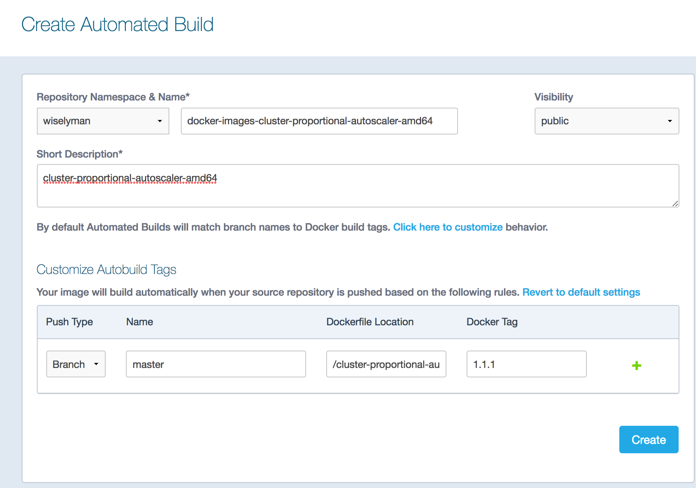

# 准备工作

## 准备代码

- fork`https://github.com/kubernetes-incubator/kubespray`到自己的账户,如我的为:`https://github.com/wiselyman/kubespray-1`;

- clone kubespray到本地,用IDE打开`kubespray`;

## 准备镜像

- 全局搜索`gcr.io`,凡是以此打头的镜像国内访问不了。

- 我们在github上建一个项目,如`docker-images`(`https://github.com/wiselyman/docker-images.git`),为每个不能pull的镜像建立文件夹，并编写`Dockerfile`文件继承不能pull的镜像，如：

    ```
    FROM gcr.io/google_containers/cluster-proportional-autoscaler-amd64:1.1.1
    MAINTAINER 285414629@qq.com
    ```

- 使用`hub.docker.com`进行自动编译(若无请注册),登录后`Create->Created Automated Build`此时绑定github账号，然后使用点击`Create Auto-build`,在`Type to filter`输入框选择`docker-images`,然后入下图进行操作:



- 将全局搜索到命中`gcr.io`的镜像替换为自己编译的镜像,如:
    
    `gcr.io/google_containers/k8s-dns-kube-dns-amd64`修改为`wiselyman/docker-images-k8s-dns-kube-dns-amd64`


## 准备二进制文件
- 全局搜索`googleapis`，我们将
`https://storage.googleapis.com/kubernetes-release/release/v1.8.1/bin/linux/amd64/kubeadm`
`https://storage.googleapis.com/istio-release/releases/0.2.6/istioctl/istioctl-linux`下载到本地并放置到工具机的`httpd`下，目录为`/var/www/html`

- 将`kubeadm_download_url: "https://storage.googleapis.com/kubernetes-release/release/{{ kubeadm_version }}/bin/linux/amd64/kubeadm"`修改为：`http://192.168.1.230/kubeadm`
- 将`istioctl_download_url: "https://storage.googleapis.com/istio-release/releases/{{ istio_version }}/istioctl/istioctl-linux"`修改为: `http://192.168.1.230/istioctl-linux`


# 工具机准备
- 安装ansible `yum install ansible`
- 安装httpd，用于放置二进制文件 `yum install httpd`
