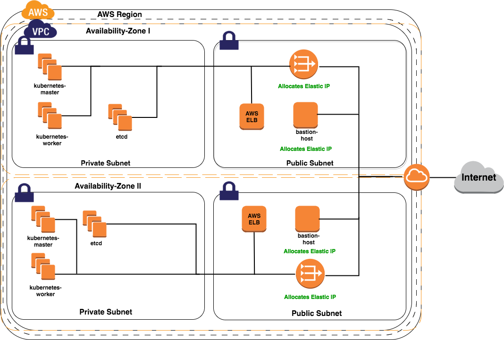

## Kubernetes on AWS with Terraform

**Overview:**

This project will create:
* VPC with Public and Private Subnets in # Availability Zones
* Bastion Hosts and NAT Gateways in the Public Subnet
* A dynamic number of masters, etcd, and worker nodes in the Private Subnet
 * even distributed over the # of Availability Zones
* AWS ELB in the Public Subnet for accessing the Kubernetes API from the internet

**Requirements**
- Terraform 0.8.7 or newer

**How to Use:**

- Export the variables for your AWS credentials or edit `credentials.tfvars`:

```
export AWS_ACCESS_KEY_ID="www"
export AWS_SECRET_ACCESS_KEY ="xxx"
export AWS_SSH_KEY_NAME="yyy"
export AWS_DEFAULT_REGION="zzz"
```
- Rename `contrib/terraform/aws/terraform.tfvars.example` to `terraform.tfvars`

- Update `contrib/terraform/aws/terraform.tfvars` with your data. By default, the Terraform scripts use CoreOS as base image. If you want to change this behaviour, see note "Using other distrib than CoreOs" below.
- Allocate a new AWS Elastic IP. Use this for your `loadbalancer_apiserver_address` value (below)
- Create an AWS EC2 SSH Key
- Run with `terraform apply --var-file="credentials.tfvars"` or `terraform apply` depending if you exported your AWS credentials

Example:
```commandline
terraform apply -var-file=credentials.tfvars -var 'loadbalancer_apiserver_address=34.212.228.77'
```

- Terraform automatically creates an Ansible Inventory file called `hosts` with the created infrastructure in the directory `inventory`

- Ansible will automatically generate an ssh config file for your bastion hosts. To connect to hosts with ssh using bastion host use generated ssh-bastion.conf.
  Ansible automatically detects bastion and changes ssh_args  
```commandline
ssh -F ./ssh-bastion.conf user@$ip
```

- Once the infrastructure is created, you can run the kubespray playbooks and supply inventory/hosts with the `-i` flag.

Example (this one assumes you are using CoreOS)
```commandline
ansible-playbook -i ./inventory/hosts ./cluster.yml -e ansible_ssh_user=core -e bootstrap_os=coreos -b --become-user=root --flush-cache
```
***Using other distrib than CoreOs***
If you want to use another distribution than CoreOS, you can modify the search filters of the 'data "aws_ami" "distro"' in variables.tf.

For example, to use:
- Debian Jessie, replace 'data "aws_ami" "distro"' in variables.tf with
data "aws_ami" "distro" {
  most_recent = true

  filter {
    name   = "name"
    values = ["debian-jessie-amd64-hvm-*"]
  }

  filter {
    name   = "virtualization-type"
    values = ["hvm"]
  }

  owners = ["379101102735"]
}

- Ubuntu 16.04, replace 'data "aws_ami" "distro"' in variables.tf with
data "aws_ami" "distro" {
  most_recent = true

  filter {
    name   = "name"
    values = ["ubuntu/images/hvm-ssd/ubuntu-xenial-16.04-amd64-*"]
  }

  filter {
    name   = "virtualization-type"
    values = ["hvm"]
  }

  owners = ["099720109477"]
}

- Centos 7, replace 'data "aws_ami" "distro"' in variables.tf with
data "aws_ami" "distro" {
  most_recent = true

  filter {
    name   = "name"
    values = ["dcos-centos7-*"]
  }

  filter {
    name   = "virtualization-type"
    values = ["hvm"]
  }

  owners = ["688023202711"]
}

**Troubleshooting**

***Remaining AWS IAM Instance Profile***:

If the cluster was destroyed without using Terraform it is possible that
the AWS IAM Instance Profiles still remain. To delete them you can use
the `AWS CLI` with the following command:
```
aws iam delete-instance-profile --region <region_name> --instance-profile-name <profile_name>
```

***Ansible Inventory doesnt get created:***

It could happen that Terraform doesnt create an Ansible Inventory file automatically. If this is the case copy the output after `inventory=` and create a file named `hosts`in the directory `inventory` and paste the inventory into the file.

**Architecture**

Pictured is an AWS Infrastructure created with this Terraform project distributed over two Availability Zones.


