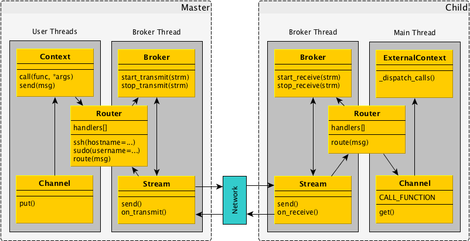

Getting Started
===============

.. warning::

    This section is incomplete.

Liability Waiver
----------------

Before proceeding, it is critical you understand what you're involving yourself
and possibly your team and its successors with:

* Constructing the most fundamental class, :py:class:`Broker
  <mitogen.master.Broker>`, causes a new thread to be spawned, exposing a huge
  class of difficult to analyse behaviours that Python software generally does
  not suffer from.

  While every effort is made to hide this complexity, you should expect
  threading-related encounters during development, and crucially, years after
  your program reached production. See :ref:`troubleshooting` for more
  information.

* While high-level abstractions are provided, they are only a convenience, you
  must still understand :ref:`how Mitogen works <howitworks>` before depending
  on it. Mitogen interacts with many aspects of the operating system,
  threading, SSH, sudo, sockets, TTYs, shell, Python runtime, and timing and
  ordering uncertainty introduced through interaction with the network, GIL and
  OS scheduling.

  Knowledge of this domain is typically attained through painful years of
  failed attempts hacking system-level programs, and learning through continual
  suffering how to debug the atrocities left behind. If you feel you lack
  resources or willpower to diagnose problems independently, Mitogen is not
  appropriate, prefer a higher level solution instead.

First Principles
----------------

Before starting, take a moment to reflect on writing a program that will
operate across machines and privilege domains:

* As with multithreaded programming, writing a program that spans multiple
  hosts is exposed to many asynchrony issues. Unlike multithreaded programming,
  the margin for unexpected failures is much higher, even between only two
  peers, as communication may be fail at any moment, since that communication
  depends on reliability of an external network.

* Since a multi-host program always spans trust and privilege domains, trust
  must be taken into consideration in your design from the outset. Mitogen
  attempts to protect the consuming application by default where possible,
  however it is paramount that trust considerations are always in mind when
  exposing any privileged functionality to a potentially untrusted network of
  peers.

  A parent must always assume data received from a child is suspect, and must
  not base privileged control decisions on that data. As a small example, a
  parent should not form a command to execute in a subprocess using strings
  received from a child.

* As the program spans multiple hosts, its design will benefit from a strict
  separation of program and data. This entails avoiding some common Python
  idioms that rely on its ability to manipulate functions and closures as if
  they were data, such as passing a lambda closed over some program state as a
  callback parameter.

  In the general case this is both difficult and unsafe to support in a
  distributed program, and so (for now at least) it should be assumed this
  functionality is unlikely to appear in future.

Broker And Router
-----------------

.. currentmodule:: mitogen.core

Execution starts when your program constructs a :py:class:`Broker` and
associated :py:class:`Router`. The broker is responsible for multiplexing IO to
children from a private thread, while in children, it is additionally
responsible for ensuring robust destruction if communication with the master
is lost.

:py:class:`Router` is responsible for receiving messages and dispatching them
to a callback from the broker thread (registered by :py:meth:`add_handler()
<mitogen.core.Router.add_handler>`), or forwarding them to a :py:class:`Stream
<mitogen.core.Stream>`. See :ref:`routing` for an in-depth description.
:py:class:`Router` also doubles as the entry point to Mitogen's public API::

    >>> import mitogen.master

    >>> broker = mitogen.master.Broker()
    >>> router = mitogen.master.Router(broker)

    >>> try:
    ...     # Your code here.
    ...     pass
    ... finally:
    ...     broker.shutdown()

As Python will not stop if threads still exist after the main thread exits,
:py:meth:`Broker.shutdown` must be called reliably at exit. Helpers are
provided by :py:mod:`mitogen.utils` to ensure :py:class:`Broker` is reliably
destroyed::

    def do_mitogen_stuff(router):
        # Your code here.

    mitogen.utils.run_with_router(do_mitogen_stuff)

If your program cannot live beneath :py:func:`mitogen.utils.run_with_router` on
the stack, you must arrange for :py:meth:`Broker.shutdown` to be called
anywhere the main thread may exit.

Enable Logging
--------------

Mitogen makes heavy use of the :py:mod:`logging` package, both for child
``stdio`` redirection, and soft errors and warnings that may be generated.

You should always configure the :py:mod:`logging` package in any program that
integrates Mitogen. If your program does not otherwise use the
:py:mod:`logging` package, a basic configuration can be performed by calling
:py:func:`mitogen.utils.log_to_file`::

    >>> import mitogen.utils

    # Errors, warnings, and child stdio will be written to stderr.
    >>> mitogen.utils.log_to_file()

Additionally, if your program has :py:const:`logging.DEBUG` as the default
logging level, you may wish to update its configuration to restrict the
``mitogen`` logger to :py:const:`logging.INFO`, otherwise vast amounts of
output will be generated by default.

.. _logging-env-vars:

Logging Environment Variables
~~~~~~~~~~~~~~~~~~~~~~~~~~~~~

``MITOGEN_LOG_LEVEL``
    Overrides the :py:mod:`logging` package log level set by any call to
    :py:func:`mitogen.utils.log_to_file`. Defaults to ``INFO``.

    If set to ``IO``, equivalent to ``DEBUG`` but additionally enabled IO
    logging for any call to :py:func:`mitogen.utils.log_to_file`. IO logging
    produces verbose records of any IO interaction, which is useful for
    debugging hangs and deadlocks.

Logging Records
~~~~~~~~~~~~~~~

Messages received from a child context via :class:`mitogen.master.LogForwarder`
receive extra attributes:

* `mitogen_context`: :class:`mitogen.parent.Context` referring to the message
  source.
* `mitogen_name`: original logger name in the source context.
* `mitogen_msg`: original message in the source context.

Creating A Context
------------------

Contexts are simply external Python programs over which your program has
control, and can execute code within. They can be created as subprocesses on
the local machine, in another user account via `sudo`, on a remote machine via
`ssh`, or any recursive combination of the above.

Now a :py:class:`Router` exists, our first :py:class:`contexts <Context>` can
be created. To demonstrate basic functionality, we will start with some
:py:meth:`local() <Router.local>` contexts created as subprocesses::

    >>> local = router.local()
    >>> local_with_name = router.local(remote_name='i-have-a-name')

Examination of the system process list with the ``pstree`` utility reveals the
resulting process hierarchy::

    | |   \-+= 27660 dmw python
    | |     |--- 27661 dmw mitogen:dmw@Eldil.local:27660
    | |     \--- 27663 dmw mitogen:i-have-a-name

Both contexts are visible as subprocesses of the interactive Python
interpreter, with their ``argv[0]`` including a description of their identity.
To aid systems administrators in identifying errant software running on their
machines, the default `remote_name` includes the location of the program that
started the context, however as shown, this can be overridden.

.. note::

    Presently contexts are constructed in a blocking manner on the thread that
    invoked the :ref:`context factory <context-factories>`. In a future
    release, the factory will instead return immediately, and construction will
    happen asynchronously on the broker thread.

Calling A Function
------------------

.. currentmodule:: mitogen.parent

Now that some contexts exist, it is time to execute code in them. Any regular
function, static method, or class method reachable directly from module scope
may be used, including built-in functions such as :func:`time.time`.

The :py:meth:`Context.call` method is used to execute a function and block the
caller until the return value is available or an exception is raised::

    >>> import time
    >>> import os

    >>> # Returns the current time.
    >>> print('Time in remote context:', local.call(time.time))

    >>> try:
    ...     # Raises OSError.
    ...     local.call(os.chdir, '/nonexistent')
    ... except mitogen.core.CallError, e:
    ...     print('Call failed:', str(e))

It is a simple wrapper around the more flexible :meth:`Context.call_async`,
which immediately returns a :class:`Receiver <mitogen.core.Receiver>` wired up
to receive the return value instead. A receiver may simply be discarded, kept
around indefinitely without ever reading its result, or used to wait on the
results from several calls. Here :meth:`get() <mitogen.core.Receiver.get>`
is called to block the thread until the result arrives::

    >>> call = local.call_async(time.time)
    >>> msg = call.get()
    >>> print(msg.unpickle())
    1507292737.75547

Running User Functions
----------------------

So far we have used the interactive interpreter to call some standard library
functions, but since the source code typed at the interpreter cannot be
recovered, Mitogen is unable to execute functions defined in this way.

We must therefore continue by writing our code as a script::

    # first-script.py
    import mitogen.utils

    def my_first_function():
        print('Hello from remote context!')
        return 123

    def main(router):
        local = router.local()
        print(local.call(my_first_function))

    if __name__ == '__main__':
        mitogen.utils.log_to_file(main)
        mitogen.utils.run_with_router(main)

Let's try running it:

.. code-block:: bash

    $ python first-script.py
    19:11:32 I mitogen.ctx.local.32466: stdout: Hello from remote context!
    123

Waiting On Multiple Calls
-------------------------

Using :meth:`Context.call_async` it is possible to start multiple function
calls then sleep waiting for responses as they are available. This makes it
trivial to run tasks in parallel across processes (including remote processes)
without the need for writing asynchronous code::

    hostnames = ['host1', 'host2', 'host3', 'host4']
    contexts = [router.ssh(hostname=hn) for hn in hostnames]
    calls = [context.call(my_func) for context in contexts]

    for msg in mitogen.select.Select(calls):
        print('Reply from %s: %s' % (recv.context, data))

Running Code That May Hang
--------------------------

When executing code that may hang due to, for example, talking to network peers
that may become unavailable, it is desirable to be able to recover control in
the case a remote call has hung.

By specifying the `timeout` parameter to :meth:`Receiver.get` on the receiver
returned by `Context.call_async`, it becomes possible to wait for a function to
complete, but time out if its result does not become available.

When a context has become hung like this, it is still possible to gracefully
terminate it using the :meth:`Context.shutdown` method. This method sends a
shutdown message to the target process, where its IO multiplexer thread can
still process it independently of the hung function running on on the target's
main thread.

Recovering Mitogen Object References In Children
------------------------------------------------

::

    @mitogen.core.takes_econtext
    def func1(a, b, econtext):
        ...

    @mitogen.core.takes_router
    def func2(a, b, router):
        ...

Recursion
---------

Let's try something a little more complex:

.. _serialization-rules:

RPC Serialization Rules
-----------------------

The following built-in types may be used as parameters or return values in
remote procedure calls:

* :class:`bool`
* :class:`bytearray`
* :func:`bytes`
* :class:`dict`
* :class:`int`
* :func:`list`
* :class:`long`
* :class:`str`
* :func:`tuple`
* :func:`unicode`

User-defined types may not be used, except for:

* :py:class:`mitogen.core.Blob`
* :py:class:`mitogen.core.Secret`
* :py:class:`mitogen.core.CallError`
* :py:class:`mitogen.core.Context`
* :py:class:`mitogen.core.Sender`

Subclasses of built-in types must be undecorated using
:py:func:`mitogen.utils.cast`.

Test Your Design
----------------

``tc qdisc add dev eth0 root netem delay 250ms``

.. _troubleshooting:

Troubleshooting
---------------

.. warning::

    This section is incomplete.

A typical example is a hang due to your application's main thread exitting
perhaps due to an unhandled exception, without first arranging for any
:py:class:`Broker <mitogen.master.Broker>` to be shut down gracefully.

Another example would be your main thread hanging indefinitely because a bug
in Mitogen fails to notice an event (such as RPC completion) your thread is
waiting for will never complete. Solving this kind of hang is a work in
progress.

router.enable_debug()
