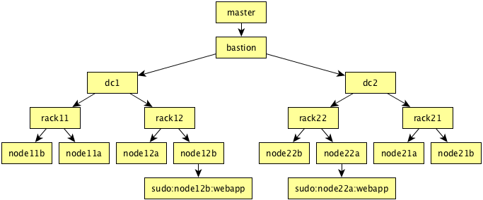

.. _howitworks:

How Mitogen Works
=================

Some effort is required to accomplish the seemingly magical feat of
bootstrapping a remote Python process without any software installed on the
remote machine. The steps involved are unlikely to be immediately obvious to
the casual reader, and they required several iterations to discover, so we
document them thoroughly below.

The UNIX First Stage
--------------------

To allow delivery of the bootstrap compressed using :py:mod:`zlib`, it is
necessary for something on the remote to be prepared to decompress the payload
and feed it to a Python interpreter. Since we would like to avoid writing an
error-prone shell fragment to implement this, and since we must avoid writing
to the remote machine's disk in case it is read-only, the Python process
started on the remote machine by Mitogen immediately forks in order to
implement the decompression.

Python Command Line
###################

The Python command line sent to the host is a :mod:`zlib`-compressed [#f1]_ and
base64-encoded copy of the :py:meth:`mitogen.master.Stream._first_stage`
function, which has been carefully optimized to reduce its size. Prior to
compression and encoding, ``CONTEXT_NAME`` is replaced with the desired context
name in the function's source code.

.. code::

    python -c 'exec "xxx".decode("base64").decode("zlib")'

The command-line arranges for the Python interpreter to decode the base64'd
component, decompress it and execute it as Python code. Base64 is used since
to protect against any special characters that may be interpreted by the system
shell in use.

Forking The First Stage
#######################

The first stage creates a UNIX pipe and saves a copy of the process's real
``stdin`` file descriptor (used for communication with the master) so that it
can be recovered by the bootstrapped process later. It then forks into a new
process.

After fork, the parent half overwrites its ``stdin`` with the read end of the
pipe, and the child half writes the string ``MITOGEN0\n``, then begins reading the
:py:mod:`zlib`-compressed payload supplied on ``stdin`` by the master, and
writing the decompressed result to the write-end of the UNIX pipe.

To allow recovery of ``stdin`` for reuse by the bootstrapped process for
parent<->child communication, it is necessary for the first stage to avoid
closing ``stdin`` or reading from it until until EOF. Therefore, the master
sends the :py:mod:`zlib`-compressed payload prefixed with an integer size,
allowing reading by the first stage of exactly the required bytes.

Configuring argv[0]
###################

Forking provides us with an excellent opportunity for tidying up the eventual
Python interpreter, in particular, restarting it using a fresh command-line to
get rid of the large base64-encoded first stage parameter, and to replace
**argv[0]** with something descriptive.

After configuring its ``stdin`` to point to the read end of the pipe, the
parent half of the fork re-executes Python, with **argv[0]** taken from the
``CONTEXT_NAME`` variable earlier substituted into its source code. As no
arguments are provided to this new execution of Python, and since ``stdin`` is
connected to a pipe (whose write end is connected to the first stage), the
Python interpreter begins reading source code to execute from the pipe
connected to ``stdin``.

Bootstrap Preparation
#####################

Now we have the mechanism in place to send a :py:mod:`zlib`-compressed script
to the remote Python interpreter, it is time to choose what to send.

The script sent is simply the source code for :py:mod:`mitogen.core`, with a
single line suffixed to trigger execution of the
:py:meth:`mitogen.core.ExternalContext.main` function. The encoded arguments
to the main function include some additional details, such as the logging package
level that was active in the parent process, and whether debugging or profiling
are enabled.

After the script source code is prepared, it is passed through
:py:func:`mitogen.master.minimize_source` to strip it of docstrings and
comments, while preserving line numbers. This reduces the compressed payload
by around 20%.

Preserving The `mitogen.core` Source
####################################

One final trick is implemented in the first stage: after bootstrapping the new
child, it writes a duplicate copy of the :py:mod:`mitogen.core` source it just
used to bootstrap it back into another pipe connected to the child. The child's
module importer cache is initialized with a copy of the source, so that
subsequent bootstraps of children-of-children do not require the source to be
fetched from the master a second time.

Signalling Success
##################

Once the first stage has signalled ``MITO000\n``, the master knows it is ready
to receive the compressed bootstrap. After decompressing and writing the
bootstrap source to its parent Python interpreter, the first stage writes the
string ``MITO001\n`` to ``stdout`` before exiting. The master process waits for
this string before considering bootstrap successful and the child's ``stdio``
ready to receive messages.

The signal value is 8 bytes to match the minimum chunk size required to
disambiguate between lines containing an interesting token during SSH password
authentication, a debug message from the SSH client itself, or a message from
the first stage.

ExternalContext.main()
----------------------

.. automethod:: mitogen.core.ExternalContext.main

Generating A Synthetic `mitogen` Package
########################################

Since the bootstrap consists of the :py:mod:`mitogen.core` source code, and
this code is loaded by Python by way of its main script (:mod:`__main__`
module), initially the module layout in the child will be incorrect.

The first step taken after bootstrap is to rearrange :py:data:`sys.modules` slightly
so that :py:mod:`mitogen.core` appears in the correct location, and all
classes defined in that module have their ``__module__`` attribute fixed up
such that :py:mod:`cPickle` correctly serializes instance module names.

Once a synthetic :py:mod:`mitogen` package and :py:mod:`mitogen.core` module
have been generated, the bootstrap **deletes** `sys.modules['__main__']`, so
that any attempt to import it (by :py:mod:`cPickle`) will cause the import to
be satisfied by fetching the master's actual :mod:`__main__` module. This is
necessary to allow master programs to be written as a self-contained Python
script.

Reaping The First Stage
#######################

After the bootstrap has called :py:func:`os.dup` on the copy of the ``stdin``
file descriptor saved by the first stage, it is closed.

Additionally, since the first stage was forked prior to re-executing the Python
interpreter, it will exist as a zombie process until the parent process reaps
it. Therefore the bootstrap must call :py:func:`os.wait` soon after startup.

Setup Logging
#############

The child's :py:mod:`logging` package root logger is configured to have the
same log level as the root logger in the master, and
:py:class:`mitogen.core.LogHandler` is installed to forward logs to the master
context's :py:data:`FORWARD_LOG <mitogen.core.FORWARD_LOG>` handle.

The log level is copied into the child to avoid generating a potentially large
amount of network IO forwarding logs that will simply be filtered away once
they reach the master.

The Module Importer
###################

An instance of :py:class:`mitogen.core.Importer` is installed in
:py:data:`sys.meta_path`, where Python's :keyword:`import` statement will
execute it before attempting to find a module locally.

Standard IO Redirection
#######################

Two instances of :py:class:`mitogen.core.IoLogger` are created, one for
``stdout`` and one for ``stderr``. This class creates a UNIX pipe whose read
end is added to the IO multiplexer, and whose write end is used to overwrite
the handles inherited during process creation.

Even without IO redirection, something must replace ``stdin`` and ``stdout``,
otherwise it is possible for the stream used for communication between parent
and child to be accidentally corrupted by subprocesses run by user code.

The inherited ``stdin`` is replaced by a file descriptor pointing to
``/dev/null``.

Finally Python's :py:data:`sys.stdout` is reopened to ensure line buffering is
active, so that ``print`` statements and suchlike promptly appear in the logs.

Function Call Dispatch
######################

.. currentmodule:: mitogen.core

After all initialization is complete, the child's main thread sits in a loop
reading from a :py:class:`Channel <mitogen.core.Channel>` connected to the
:py:data:`CALL_FUNCTION <mitogen.core.CALL_FUNCTION>` handle. This handle is
written to by
:py:meth:`call() <mitogen.parent.Context.call>`
and :py:meth:`call_async() <mitogen.parent.Context.call_async>`.

:py:data:`CALL_FUNCTION <mitogen.core.CALL_FUNCTION>` only accepts requests
from the context IDs listed in :py:data:`mitogen.parent_ids`, forming a chain
of trust between the master and any intermediate context leading to the
recipient of the message. In combination with :ref:`source-verification`, this
is a major contributor to ensuring contexts running on compromised
infrastructure cannot trigger code execution in siblings or any parent.

Shutdown
########

.. currentmodule:: mitogen.core

When a context receives :py:data:`SHUTDOWN <mitogen.core.SHUTDOWN>` from its
immediate parent, it closes its own :py:data:`CALL_FUNCTION
<mitogen.core.CALL_FUNCTION>` :py:class:`Channel <mitogen.core.Channel>` before
sending :py:data:`SHUTDOWN <mitogen.core.SHUTDOWN>` to any directly connected
children. Closing the channel has the effect of causing
:py:meth:`ExternalContext._dispatch_calls` to exit and begin joining on the
broker thread.

During shutdown, the master waits up to 5 seconds for children to disconnect
gracefully before force disconnecting them, while children will use that time
to call :py:meth:`socket.shutdown(SHUT_WR) <socket.socket.shutdown>` on their
:py:class:`IoLogger <mitogen.core.IoLogger>` socket's write ends before
draining any remaining data buffered on the read ends, and ensuring any
deferred broker function callbacks have had a chance to complete, necessary to
capture for example forwarding any remaining :py:mod:`logging` records.

An alternative approach is to wait until the IoLogger socket is completely
closed, with some hard timeout, but this necessitates greater discipline than
is common in infrastructure code (how often have you forgotten to redirect
stderr to ``/dev/null`` when starting a daemon process?), so needless
irritating delays would often be experienced during program termination.

If the main thread (responsible for function call dispatch) fails to shut down
gracefully, because some user function is hanging, it will still be cleaned up
since as the final step in broker shutdown, the broker sends
:py:mod:`signal.SIGTERM <signal>` to its own process.

.. _stream-protocol:

Stream Protocol
---------------

.. currentmodule:: mitogen.core

Once connected, a basic framing protocol is used to communicate between
parent and child. Integers use big endian in their encoded form.

.. list-table::
    :header-rows: 1
    :widths: auto

    * - Field
      - Size
      - Description

    * - `dst_id`
      - 4
      - Integer target context ID. :py:class:`Router` delivers messages
        locally when their `dst_id` matches :py:data:`mitogen.context_id`,
        otherwise they are routed up or downstream.

    * - `src_id`
      - 4
      - Integer source context ID. Used as the target of replies if any are
        generated.

    * - `auth_id`
      - 4
      - The context ID under whose authority the message is acting. See
        :py:ref:`source-verification`.

    * - `handle`
      - 4
      - Integer target handle in the destination context. This is one of the
        :py:ref:`standard-handles`, or a dynamically generated handle used to
        receive a one-time reply, such as the return value of a function call.

    * - `reply_to`
      - 4
      - Integer target handle to direct any reply to this message. Used to
        receive a one-time reply, such as the return value of a function call,
        or to signal a special condition for the message. :ref:`See below
        <reply_to_values>` for special values for this field.

    * - `length`
      - 4
      - Length of the data part of the message.

    * - `data`
      - n/a
      - Message data, which may be raw or pickled.

.. _standard-handles:

Standard Handles
################

Masters listen on the following handles:

.. _FORWARD_LOG:
.. currentmodule:: mitogen.core
.. data:: FORWARD_LOG

    Receives `(logger_name, level, msg)` 3-tuples and writes them to the
    master's ``mitogen.ctx.<context_name>`` logger.

.. _GET_MODULE:
.. currentmodule:: mitogen.core
.. data:: GET_MODULE

    Receives the name of a module to load `fullname`, locates the source code
    for `fullname`, and routes one or more :py:data:`LOAD_MODULE` messages back
    towards the sender of the :py:data:`GET_MODULE` request. If lookup fails,
    :data:`None` is sent instead.

    See :ref:`import-preloading` for a deeper discussion of
    :py:data:`GET_MODULE`/:py:data:`LOAD_MODULE`.

.. _ALLOCATE_ID:
.. currentmodule:: mitogen.core
.. data:: ALLOCATE_ID

    Replies to any message sent to it with a newly allocated range of context
    IDs, to allow children to safely start their own contexts. Presently IDs
    are allocated in batches of 1000 from a 32 bit range, allowing up to 4.2
    million parent contexts to be created and destroyed before the associated
    Router must be recreated.

Children listen on the following handles:

.. _LOAD_MODULE:
.. currentmodule:: mitogen.core
.. data:: LOAD_MODULE

    Receives `(pkg_present, path, compressed, related)` tuples, composed of:

    * **pkg_present**: Either :data:`None` for a plain ``.py`` module, or a
      list of canonical names of submodules existing witin this package. For
      example, a :py:data:`LOAD_MODULE` for the :py:mod:`mitogen` package would
      return a list like: `["mitogen.core", "mitogen.fakessh",
      "mitogen.master", ..]`. This list is used by children to avoid generating
      useless round-trips due to Python 2.x's :keyword:`import` statement
      behavior.
    * **path**: Original filesystem where the module was found on the master.
    * **compressed**: :py:mod:`zlib`-compressed module source code.
    * **related**: list of canonical module names on which this module appears
      to depend. Used by children that have ever started any children of their
      own to preload those children with :py:data:`LOAD_MODULE` messages in
      response to a :py:data:`GET_MODULE` request.

.. _CALL_FUNCTION:
.. currentmodule:: mitogen.core
.. data:: CALL_FUNCTION

    Receives `(chain_id, mod_name, class_name, func_name, args, kwargs)`
    6-tuples from :class:`mitogen.parent.CallChain`, imports ``mod_name``, then
    attempts to execute `class_name.func_name(\*args, \**kwargs)`.

    * `chain_id`: if not :data:`None`, an identifier unique to the originating
      :class:`mitogen.parent.CallChain`. When set, if an exception occurs
      during a call, future calls with the same ID automatically fail with the
      same exception without ever executing, and failed calls with no
      `reply_to` set are not dumped to the logging framework as they otherwise
      would. This is used to implement pipelining.

    When this channel is closed (by way of receiving a dead message), the
    child's main thread begins graceful shutdown of its own :py:class:`Broker`
    and :py:class:`Router`.

.. _SHUTDOWN:
.. currentmodule:: mitogen.core
.. data:: SHUTDOWN

    When received from a child's immediate parent, causes the broker thread to
    enter graceful shutdown, including sending a dead message to the child's
    main thread, causing it to join on the exit of the broker thread.

    The final step of a child's broker shutdown process sends
    :py:mod:`signal.SIGTERM <signal>` to itself, ensuring the process dies even
    if the main thread was hung executing user code.

    Each context is responsible for sending :py:data:`SHUTDOWN` to each of its
    directly connected children in response to the master sending
    :py:data:`SHUTDOWN` to it, and arranging for the connection to its parent
    to be closed shortly thereafter.

Masters, and children that have ever been used to create a descendent child
also listen on the following handles:

.. _ADD_ROUTE:
.. currentmodule:: mitogen.core
.. data:: ADD_ROUTE

    Receives `target_id` integer from downstream, describing an ID allocated to
    a recently constructed child. The receiver verifies no existing route
    exists to `target_id` before updating its local table to route messages for
    `target_id` via the stream from which the :py:data:`ADD_ROUTE` message was
    received.

.. _DEL_ROUTE:
.. currentmodule:: mitogen.core
.. data:: DEL_ROUTE

    Receives `target_id` integer from downstream, verifies a route exists to
    `target_id` via the stream on which the message was received, removes that
    route from its local table, then propagates the message upward towards its
    own parent.

.. currentmodule:: mitogen.core
.. data:: DETACHING

    Sent to inform a parent that user code has invoked
    :meth:`ExternalContext.detach` to decouple the lifecycle of a directly
    connected context and its subtree from the running program.

    A child usually shuts down immediately if it loses its parent connection,
    and parents usually terminate any related Python/SSH subprocess on
    disconnection. Receiving :data:`DETACHING` informs the parent the
    connection will soon drop, but the process intends to continue life
    independently, and to avoid terminating the related subprocess if that
    subprocess is the child itself.

Non-master parents also listen on the following handles:

.. currentmodule:: mitogen.core
.. data:: GET_MODULE

    As with master's ``GET_MODULE``, except this implementation
    (:py:class:`mitogen.master.ModuleForwarder`) serves responses using
    :py:class:`mitogen.core.Importer`'s cache before forwarding the request to
    its parent context. The response is cached by each context in turn before
    being forwarded on to the child context that originally made the request.
    In this way, the master need never re-send a module it has already sent to
    a direct descendant.

.. currentmodule:: mitogen.core
.. data:: FORWARD_MODULE

    Receives `(context, fullname)` tuples from its parent and arranges for a
    :data:`LOAD_MODULE` to be sent towards `context` for the module `fullname`
    and any related modules. The module must already have been delivered to the
    current context by its parent in a prior :data:`LOAD_MODULE` message.

    If the receiver is the immediate parent of `context`, then only
    :data:`LOAD_MODULE` is sent to the child. Otherwise :data:`LOAD_MODULE` is
    sent to the next closest parent if the module has not previously been sent
    on that stream, followed by a copy of the :data:`FORWARD_MODULE` message.

    This message is used to recursively preload indirect children with modules,
    ensuring they are cached and deduplicated at each hop in the chain leading
    to the target context.

.. _reply_to_values:

Special values for the `reply_to` field:

.. _IS_DEAD:
.. currentmodule:: mitogen.core
.. autodata:: IS_DEAD

Additional handles are created to receive the result of every function call
triggered by :py:meth:`call_async() <mitogen.parent.Context.call_async>`.

Use of Pickle
#############

The current implementation uses the Python :py:mod:`cPickle` module, with a
restrictive class whitelist to prevent triggering undesirable code execution.
The primary reason for using :py:mod:`cPickle` is that it is computationally
efficient, and avoids including a potentially large body of serialization code
in the bootstrap.

The pickler will instantiate only built-in types and one of 3 constructor
functions, to support unpickling :py:class:`CallError
<mitogen.core.CallError>`, :py:class:`mitogen.core.Sender`,and
:py:class:`Context <mitogen.core.Context>`.

The choice of Pickle is one area to be revisited later. All accounts suggest it
cannot be used securely, however few of those accounts appear to be expert, and
none mention any additional attacks that would not be prevented by using a
restrictive class whitelist.

The IO Multiplexer
------------------

Since we must include our IO multiplexer as part of the bootstrap,
off-the-shelf implementations are for the most part entirely inappropriate. For
example, a minimal copy of Twisted weighs in at around 440KiB and is composed
of approximately 115 files. Even if we could arrange for an entire Python
package to be transferred during bootstrap, this minimal configuration is
massive in comparison to Mitogen's solution, multiplies quickly in the
presence of many machines, and would require manually splitting up the parts of
Twisted that we would like to use.

.. _routing:

Message Routing
---------------

Routing assumes it is impossible to construct a tree such that one of a
context's parents will not know the ID of a target the context is attempting to
communicate with.

When :py:class:`mitogen.core.Router` receives a message, it checks the IDs
associated with its directly connected streams for a potential route. If any
stream matches, either because it directly connects to the target ID, or
because the master sent an :py:data:`ADD_ROUTE <mitogen.core.ADD_ROUTE>`
message associating it, then the message will be forwarded down the tree using
that stream.

If the message does not match any :py:data:`ADD_ROUTE <mitogen.core.ADD_ROUTE>`
message or stream, instead it is forwarded upwards to the immediate parent, and
recursively by each parent in turn until one is reached that knows how to
forward the message down the tree.

When a parent establishes a new child, it sends a corresponding
:py:data:`ADD_ROUTE <mitogen.core.ADD_ROUTE>` message towards its parent, which
recursively forwards it up towards the root.

Parents keep note of all routes associated with each stream they connect with,
and trigger ``DEL_ROUTE`` messages propagated upstream for each route
associated with that stream if the stream is disconnected for any reason.

Example
#######

In the diagram, when ``node12b`` is creating the ``sudo:node12b:webapp``
context, it must send ``ADD_ROUTE`` messages to ``rack12``, which will
propagate it to ``dc1``, and recursively to ``bastion``, and ``master``;
``node12b`` does not require an ``ADD_ROUTE`` message since it has a stream
directly connected to the new context.

Since Mitogen streams are strictly ordered, it is never possible for a parent
to receive a message from a newly constructed child before receiving a
corresponding ``ADD_ROUTE`` sent by the child's parent, describing how to reply
to it.

When ``sudo:node22a:webapp`` wants to send a message to
``sudo:node12b:webapp``, the message will be routed as follows:

``sudo:node22a:webapp -> node22a -> rack22 -> dc2 -> bastion -> dc1 -> rack12 -> node12b -> sudo:node12b:webapp``

.. image:: images/route.png

Disconnect Propagation
######################

To ensure timely shutdown when a failure occurs, where some context is awaiting
a response from another context that has become disconnected,
:class:`mitogen.core.Router` additionally records the destination context ID of
every message received on a particular stream.

When ``DEL_ROUTE`` is generated locally or received on some other stream,
:class:`mitogen.parent.RouteMonitor` uses this to find every stream that ever
communicated with the route that is about to go away, and forwards the message
to each found.

The recipient ``DEL_ROUTE`` handler in turn uses the message to find any
:class:`mitogen.core.Context` in the local process corresponding to the
disappearing route, and if found, fires a ``disconnected`` event on it.

Any interested party, such as :class:`mitogen.core.Receiver`, may subscribe to
the event and use it to abort any threads that were asleep waiting for a reply
that will never arrive.

.. _source-verification:

Source Verification
###################

Before forwarding or dispatching a message it has received,
:py:class:`mitogen.core.Router` first looks up the corresponding
:py:class:`mitogen.core.Stream` it would use to send responses towards the
context ID listed in the `auth_id` field, and if the looked up stream does not
match the stream on which the message was received, the message is discarded
and a warning is logged.

This creates a trust chain leading up to the root of the tree, preventing
downstream contexts from injecting messages appearing to be from the master or
any more trustworthy parent. In this way, privileged functionality such as
:py:data:`CALL_FUNCTION <mitogen.core.CALL_FUNCTION>` can base trust decisions
on the accuracy of :py:ref:`auth_id <stream-protocol>`.

The `auth_id` field is separate from `src_id` in order to support granting
privilege to contexts that do not follow the tree's natural trust chain. This
supports cases where siblings are permitted to execute code on one another, or
where isolated processes can connect to a listener and communicate with an
already established established tree.

Differences Between Master And Child Brokers
############################################

The main difference between :py:class:`mitogen.core.Broker` and
:py:class:`mitogen.master.Broker` is that when the stream connection to the
parent is lost in a child, the broker will trigger its own shutdown.

The Module Importer
-------------------

:py:class:`mitogen.core.Importer` is still a work in progress, as there
are a variety of approaches to implementing it, and the present implementation
is not pefectly efficient in every case.

It operates by intercepting :keyword:`import` statements via
:py:data:`sys.meta_path`, asking Python if it can satisfy the import by itself,
and if not, indicating to Python that it is capable of loading the module.

In :py:meth:`load_module() <mitogen.core.Importer.load_module>` an RPC is
started to the parent context, requesting the module source code by way of a
:py:data:`GET_MODULE <mitogen.core.GET_MODULE>`. If the parent context does not
have the module available, it recursively forwards the request upstream, while
avoiding duplicate requests for the same module from its own threads and any
child contexts.

Neutralizing :py:mod:`__main__`
###############################

To avoid accidental execution of the :py:mod:`__main__` module's code in a
slave context, when serving the source of the main module, Mitogen removes any
code occurring after the first conditional that looks like a standard
:py:mod:`__main__` execution guard:

.. code-block:: python

    # Code that looks like this is stripped from __main__.
    if __name__ == '__main__':
        run_some_code()

This is a hack, but it's the least annoying hack I've found for the problem
yet.

Avoiding Negative Imports
#########################

In Python 2.x where relative imports are the default, a large number of import
requests will be made for modules that do not exist. For example:

.. code-block:: python

    # mypkg/__init__.py

    import sys
    import os

In Python 2.x, Python will first try to load :py:mod:`mypkg.sys` and
:py:mod:`mypkg.os`, which do not exist, before falling back on :py:mod:`sys`
and :py:mod:`os`.

These negative imports present a challenge, as they introduce a large number of
pointless network round-trips. Therefore in addition to the
:py:mod:`zlib`-compressed source, for packages the master sends along a list of
child modules known to exist.

Before indicating it can satisfy an import request,
:py:class:`mitogen.core.Importer` first checks to see if the module belongs to
a package it has previously imported, and if so, ignores the request if the
module does not appear in the enumeration of child modules belonging to the
package that was provided by the master.

.. _import-preloading:

Import Preloading
#################

.. currentmodule:: mitogen.core

To further avoid round-trips, when a module or package is requested by a child,
its bytecode is scanned in the master to find all the module's
:keyword:`import` statements, and of those, which associated modules appear to
have been loaded in the master's :py:data:`sys.modules`.

The :py:data:`sys.modules` check is necessary to handle various kinds of
conditional execution, for example, when a module's code guards an
:keyword:`import` statement based on the active Python runtime version,
operating system, or optional third party dependencies.

Before replying to a child's request for a module with dependencies:

* If the request is for a package, any dependent modules used by the package
  that appear within the package itself are known to be missing from the child,
  since the child requested the top-level package module, therefore they are
  pre-loaded into the child using :py:data:`LOAD_MODULE` messages before
  sending the :py:data:`LOAD_MODULE` message for the requested package module
  itself. In this way, the child will already have dependent modules cached by
  the time it receives the requested module, avoiding one round-trip for each
  dependency.

  For example, when a child requests the :py:mod:`django` package, and the master
  determines the :py:mod:`django` module code in the master has :keyword:`import`
  statements for :py:mod:`django.utils`, :py:mod:`django.utils.lru_cache`, and
  :py:mod:`django.utils.version`,
  and that execution of the module code on the master caused those modules to
  appear in the master's :py:data:`sys.modules`, there is high probability
  execution of the :py:mod:`django` module code in the child will cause the
  same modules to be loaded. Since all those modules exist within the
  :py:mod:`django` package, and we already know the child lacks that package,
  it is safe to assume the child will make follow-up requests for those modules
  too.

  In the example, 4 round-trips are replaced by 1 round-trip.

For any package module ever requested by a child, the parent keeps a note of
the name of the package for one final optimization:

* If the request is for a sub-module of a package, and it is known the child
  loaded the package's implementation from the parent, then any dependent
  modules of the requested module at any nesting level within the package that
  is known to be missing are sent using :py:data:`LOAD_MODULE` messages before
  sending the :py:data:`LOAD_MODULE` message for the requested module, avoiding
  1 round-trip for each dependency within the same top-level package.

  For example, when a child has previously requested the :py:mod:`django`
  package module, the parent knows the package was completely absent on the
  child. Therefore when the child subsequently requests the
  :py:mod:`django.db` package module, it is safe to assume the child will
  generate subsequent :py:data:`GET_MODULE` requests for the 2
  :py:mod:`django.conf`, 3 :py:mod:`django.core`, 2 :py:mod:`django.db`, 3
  :py:mod:`django.dispatch`, and 7 :py:mod:`django.utils` indirect dependencies
  for :py:mod:`django.db`.

  In the example, 17 round-trips are replaced by 1 round-trip.

The method used to detect import statements is similar to the standard library
:py:mod:`modulefinder` module: rather than analyze module source code,
:ref:`IMPORT_NAME <python:bytecodes>` opcodes are extracted from the module's
bytecode. This is since clean source analysis methods (:py:mod:`ast` and
:py:mod:`compiler`) are an order of magnitude slower, and incompatible across
major Python versions.

Concurrency
###########

Duplicate requests must never be issued to the parent, either due to a local
import or any :py:data:`GET_MODULE` originating from a child. This lets parents
assume a module requested once by a downstream connection need never be
re-sent, for example, if it appears as a preloading dependency in a subsequent
:py:data:`GET_MODULE`, or had been requested immediately after being sent as a
preloading dependency for an unrelated request by a descendent.

Therefore each tree layer must deduplicate :py:data:`GET_MODULE` requests, and
synchronize their descendents and local threads on corresponding
:py:data:`LOAD_MODULE` responses from the parent.

In each context, pending requests are serialized by a
:py:class:`threading.Lock` within :py:class:`mitogen.core.Importer`, which may
only be held for operations that cannot block, since :py:class:`ModuleForwarder
<mitogen.master.ModuleForwarder>` must acquire it while synchronizing
:py:data:`GET_MODULE` requests from children on the IO multiplexer thread.

Requests From Local Threads
~~~~~~~~~~~~~~~~~~~~~~~~~~~

When Mitogen begins satisfying an import, it is known the module has never been
imported in the local process. :py:class:`Importer <mitogen.core.Importer>`
executes under the runtime importer lock, ensuring :py:keyword:`import`
statements executing in local threads are serialized.

.. note::
   
    In Python 2, :py:exc:`ImportError` is raised when :py:keyword:`import` is
    attempted while the runtime import lock is held by another thread,
    therefore imports must be serialized by only attempting them from the main
    (:py:data:`CALL_FUNCTION`) thread.

    The problem is most likely to manifest in third party libraries that lazily
    import optional dependencies at runtime from a non-main thread. The
    workaround is to explicitly import those dependencies from the main thread
    before initializing the third party library.

    This was fixed in Python 3.5, but Python 3.x is not yet supported. See
    `Python Issue #9260`_.

.. _Python Issue #9260: https://bugs.python.org/issue9260

While holding its own lock, :py:class:`Importer <mitogen.core.Importer>`
checks if the source is not yet cached, determines if an in-flight
:py:data:`GET_MODULE` exists for it, starting one if none exists, adds itself
to a list of callbacks fired when a corresponding :py:data:`LOAD_MODULE`
arrives from the parent, then sleeps waiting for the callback.

When the source becomes available, the module is constructed on the calling
thread using the best practice documented in `PEP 302`_.

.. _PEP 302: https://www.python.org/dev/peps/pep-0302/

Requests From Children
~~~~~~~~~~~~~~~~~~~~~~

As with local imports, when :py:data:`GET_MODULE` is received from a child,
while holding the :py:class:`Importer <mitogen.core.Importer>` lock,
:py:class:`ModuleForwarder <mitogen.master.ModuleForwarder>` checks if the
source is not yet cached, determines if an in-flight :py:data:`GET_MODULE`
toward the parent exists for it, starting one if none exists, then adds a
completion handler to the list of callbacks fired when a corresponding
:py:data:`LOAD_MODULE` arrives from the parent.

When the source becomes available, the completion handler issues corresponding
:py:data:`LOAD_MODULE` messages toward the child for the requested module after
any required for dependencies known to be absent from the child.

Since intermediaries do not know a module's dependencies until the module's
source arrives, it is not possible to preemptively issue :py:data:`LOAD_MODULE`
for those dependencies toward a requesting child as they become available from
the parent at the intermediary. This creates needless network serialization and
latency that should be addressed in a future design.

Child Module Enumeration
########################

Package children are enumerated using :py:func:`pkgutil.iter_modules`.

Use Of Threads
--------------

The package always runs the IO multiplexer in a thread. This is so the
multiplexer retains control flow in order to shut down gracefully, say, if the
user's code has hung and the master context has disconnected.

While it is possible for the IO multiplexer to recover control of a hung
function call on UNIX using for example :py:mod:`signal.SIGALRM <signal>`, this
mechanism is not portable to non-UNIX operating systems, and does not work in
every case, for example when Python blocks signals during a variety of
:py:mod:`threading` package operations.

At some point it is likely Mitogen will be extended to support children running
on Windows. When that happens, it would be nice if the process model on Windows
and UNIX did not differ, and in fact the code used on both were identical.

.. _waking-sleeping-threads:

Waking Sleeping Threads
#######################

Due to fundamental deficiencies in Python 2's threading implementation, it is
not possible to block waiting on synchronization objects sanely. Two major
problems exist:

* Sleeping with no timeout set causes signals to be blocked, preventing the
  user from terminating the process using CTRL+C.

* Sleeping with a timeout set internally makes use of polling, with an
  exponential backoff that eventually results in the thread sleeping
  unconditionally in 50ms increments. . This is a huge source of latency that
  quickly multiplies.

As the UNIX self-pipe trick must already be employed to wake the broker thread
from its select loop, Mitogen reuses this technique to wake any thread
synchronization primitive exposed by the library, embodied in a queue-like
abstraction called a :py:class:`mitogen.core.Latch`.

Unfortunately it is commonplace for hosts to enforce severe per-process file
descriptors limits, so aside from being inefficient, it is impossible in the
usual case to create a pair of descriptors for every waitable object, which for
example includes the result of every single asynchronous function call.

For this reason self-pipes are created on a per-thread basis, with their
associated :py:func:`socketpairs <socket.socketpair>` kept in thread-local
storage. When a latch wishes to sleep its thread, this pair is created
on-demand and temporarily associated with it only for the duration of the
sleep.

Python's garbage collector is relied on to clean up by calling the pair's
destructor on thread exit. There does not otherwise seem to be a robust method
to trigger cleanup code on arbitrary threads.

To summarize, file descriptor usage is bounded by the number of threads rather
than the number of waitables, which is a much smaller number, however it also
means that Mitogen requires twice as many file descriptors as there are user
threads, with a minimum of 4 required in any configuration.

Latch Internals
~~~~~~~~~~~~~~~

.. currentmodule:: mitogen.core

Attributes:

* `lock` – :py:class:`threading.Lock`.
* `queue` – items waiting to be dequeued.
* `sleeping` – write sides of the socketpairs for each sleeping thread, and
  threads in the process of waking from sleep.
* `waking` – integer number of `sleeping` threads in the process of waking up.
* `closed` – boolean defaulting to :py:data:`False`. Every time `lock`
  is acquired, `closed` must be tested, and if it is :py:data:`True`,
  :py:class:`LatchError` must be thrown.

Latch.put()
~~~~~~~~~~~

:py:meth:`Latch.put` operates by:

1. Acquiring `lock`.
2. Appending the item on to `queue`.
3. If `waking` is less than the length of `sleeping`, write a byte to the
   socket at `sleeping[waking]` and increment `waking`.

In this way each thread is woken only once, and receives each element according
to when its socket was placed on `sleeping`.

Latch.close()
~~~~~~~~~~~~~

:py:meth:`Latch.close` acquires `lock`, sets `closed` to :py:data:`True`, then
writes a byte to every `sleeping[waking]` socket, while incrementing `waking`,
until no more unwoken sockets exist. Per above, on waking from sleep, after
removing itself from `sleeping`, each sleeping thread tests if `closed` is
:py:data:`True`, and if so throws :py:class:`LatchError`.

It is necessary to ensure at most one byte is delivered on each socket, even if
the latch is being torn down, as the sockets outlive the scope of a single
latch, and must never have extraneous data buffered on them, as this will cause
unexpected wakeups if future latches sleep on the same thread.

Latch.get()
~~~~~~~~~~~

:py:meth:`Latch.get` is far more intricate, as there are many outcomes to
handle. Queue ordering is strictly first-in first-out, and threads always
receive items in the order they are requested, as they become available.

**1. Non-empty, No Waiters, No sleep**
    On entry `lock` is taken, and if `queue` is non-empty, and `sleeping` is
    empty, it is safe to return `queue`'s first item without blocking.

**2. Non-empty, Waiters Present, Queue > Waiters, No sleep**
    When `sleeping` is non-empty but there are more items than sleeping
    threads, it is safe to pop `queue[len(sleeping)]` without blocking.

**3. Non-empty, Waiters Present, Queue <= Waiters**
    In this case `sleeping` is non-empty and there are no surplus items. It is
    not safe to pop any item even though we are holding `lock`, as it would
    starve waking threads of their position in favour of the calling thread,
    since scheduling uncertainty exists between a thread waking from
    :py:func:`select.select` and re-acquiring `lock`.

    This avoids the need for a retry loop for waking threads, and a thread
    being continually re-woken to discover `queue` drained by a thread that
    never slept.

**4. Sleep**
    Since no surplus items existed, the thread adds its socket to `sleeping`
    before releasing `lock`, and sleeping in :py:func:`select.select` waiting
    for timeout, or a write from :py:meth:`Latch.put` or
    :py:meth:`Latch.close`.

    If :py:func:`select.select` throws an exception, the exception must be
    caught and re-raised only after some of the wake steps below have
    completed.

**5. Wake, Non-empty**
    On wake `lock` is re-acquired, the socket is removed from `sleeping` after
    noting its index, and :py:class:`TimeoutError` is thrown if `waking`
    indicates :py:meth:`Latch.put()` nor :py:meth:`Latch.close` have yet to
    send a wake byte to that index. The byte is then read off,
    :py:class:`LatchError` is thrown if `closed` is :py:data:`True`, otherwise
    the queue item corresponding to the thread's index is popped and returned.

    It is paramount that in every case, if a byte was written to the socket,
    that the byte is read away. The socket is reused by subsequent latches
    sleeping on the same thread, and unexpected wakeups are triggered if
    extraneous data remains buffered on the socket.

    It is also necessary to favour the synchronized `waking` variable over the
    return value of :py:func:`select.select`, as scheduling uncertainty
    introduces a race between the select timing out, and :py:meth:`Latch.put()`
    or :py:meth:`Latch.close` writing a wake byte before :py:meth:`Latch.get`
    has re-acquired `lock`.

.. rubric:: Footnotes

.. [#f1] Compression may seem redundant, however it is basically free and reducing IO
   is always a good idea. The 33% / 200 byte saving may mean the presence or
   absence of an additional frame on the network, or in real world terms after
   accounting for SSH overhead, around a 2% reduced chance of a stall during
   connection setup due to a dropped frame.
