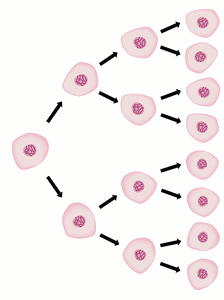
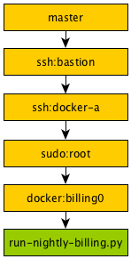
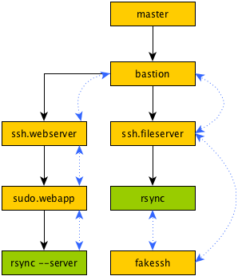
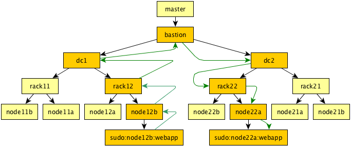
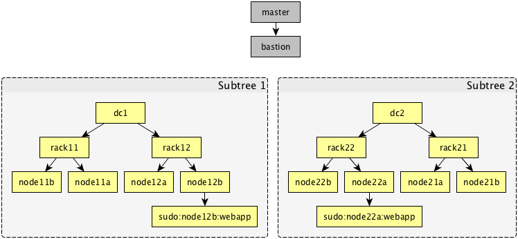

Mitogen
=======

Mitogen is a Python library for writing distributed self-replicating programs.

.. raw:: html

    

There is no requirement for installing packages, copying files around, writing
shell snippets, upfront configuration, or providing any secondary link to a
remote machine aside from an SSH connection. Due to its origins for use in
managing potentially damaged infrastructure, the **remote machine need not even
have free disk space or a writeable filesystem**.

It is not intended as a generic RPC framework; the goal is to provide a robust
and efficient low-level API on which tools like `Salt`_, `Ansible`_, or
`Fabric`_ can be built, and while the API is quite friendly and comparable to
`Fabric`_, ultimately it is not intended for direct use by consumer software.

.. _Salt: https://docs.saltstack.com/en/latest/
.. _Ansible: http://docs.ansible.com/
.. _Fabric: http://www.fabfile.org/

The focus is to centralize and perfect the intricate dance required to run
Python code safely and efficiently on a remote machine, while **avoiding
temporary files or large chunks of error-prone shell scripts**, and supporting
common privilege escalation techniques like `sudo`, potentially in combination
with exotic connection methods such as WMI, `telnet`, or console-over-IPMI.

Automatic Bootstrap
###################

Mitogen's main feature is enabling your Python program to bootstrap and
communicate with new copies of itself under its control running on remote
machines, **using only an existing installed Python interpreter and SSH
client**, something that by default can be found on almost all contemporary
machines in the wild. To accomplish bootstrap, Mitogen uses a single 400 byte
SSH command line and 8KB of its own source code sent to stdin of the remote SSH
connection.

.. command-output:: python ../preamble_size.py

Once bootstrapped, the remote process is configured with a customizable
**argv[0]**, readily visible to system administrators of the remote machine
using the UNIX **ps** command:

.. code::

    20051 ?        Ss     0:00  \_ sshd: dmw [priv]
    20053 ?        S      0:00  |   \_ sshd: dmw@notty
    20054 ?        Ssl    0:00  |       \_ /usr/bin/python(mitogen:dmw@Eldil.home:22476)
    20103 ?        S      0:00  |           \_ tar zxvf myapp.tar.gz

The example context was started by UID ``dmw`` on host ``Eldil.home``, process
ID ``22476``.

IO Multiplexer
##############

The bootstrap includes a compact IO multiplexer (like Twisted or asyncio) that
allows it to perform work in the background while executing your program's
code. For example, the remote context can be used to **connect to a new user on
the remote machine using sudo**, or as an intermediary for extending the
program's domain of control outward to other machines, enabling your program to
**manipulate machines behind a firewall**, or enable its **data plane to cohere
to your network topology**.

.. code::

    bastion_host = router.ssh(
        hostname='jump-box.mycorp.com'
    )

    docker_host = router.ssh(
        via=bastion_host,
        hostname='docker-a.prod.mycorp.com'
    )

    sudo_account = router.sudo(
        via=docker_host,
        username='user_with_magic_ssh_key',
        password='sudo password',
    )

    internal_box = router.docker(
        via=sudo_account,
        container='billing0',
    )

    internal_box.call(os.system, './run-nightly-billing.py')

The multiplexer also ensures the remote process is terminated if your Python
program crashes, communication is lost, or the application code running in the
context has hung.

Module Forwarder
################

Slaves are configured with a custom `PEP-302 importer`_ that forwards requests
for unknown Python modules back to the host program. When your program asks a
context to execute code from an unknown module, all requisite modules are
transferred automatically and imported entirely in RAM without need for further
configuration.

.. _PEP-302 importer: https://www.python.org/dev/peps/pep-0302/

.. code-block:: python

    import myapp.mypkg.mymodule

    # myapp/__init__.py, myapp/mypkg/__init__.py, and myapp/mypkg/mymodule.py
    # are transferred automatically.
    print(context.call(myapp.mymodule.my_function))

As the forwarder reuses the import mechanism, it should integrate cleanly with
any tool such as `py2exe`_ that correctly implement the protocols in PEP-302,
allowing truly single file applications to run across multiple machines without
further effort.

.. _py2exe: http://www.py2exe.org/

Common sources of import latency and bandwidth consumption are mitigated:

* Modules need only be uploaded once per directly connected context. Subsequent
  requests for modules from children of that context will be served by the
  child itself.

* Imports by threads within a context triggering a load are deduplicated and
  joined with any identical requests triggered by other threads in the same
  context and children in the context's subtree.

* No roundtrip is required for negative responses due to Python 2's import
  statement semantics: children have a list of submodules belonging to a
  package, and ignore requests for submodules that did not exist on the master.

* Imports are extracted from each module, compared to those found in memory,
  and recursively preloaded into children requesting that module, minimizing
  round-trips to one per package nesting level. For example,
  :py:mod:`django.db.models` only requires 3 round-trips to transfer 456KiB,
  representing 1.7MiB of uncompressed source split across 148 modules.

SSH Client Emulation
####################

Support is included for starting subprocesses with a modified environment, that
cause their attempt to use SSH to be redirected back into the host program. In
this way tools like `rsync`, `git`, `sftp`, and `scp` can efficiently reuse the
host program's existing connection to the remote machine, including any
firewall/user account hopping in use, with no additional configuration.

Scenarios that were not previously possible with these tools are enabled, such
as running `sftp` and `rsync` over a `sudo` session, to an account the user
cannot otherwise directly log into, including in restrictive environments that
for example enforce an interactive TTY and account password.

.. raw:: html

   

.. code-block:: python

    bastion = router.ssh(hostname='bastion.mycorp.com')
    webserver = router.ssh(via=bastion, hostname='webserver')
    webapp = router.sudo(via=webserver, username='webapp')
    fileserver = router.ssh(via=bastion, hostname='fileserver')

    # Transparently tunnelled over fileserver -> .. -> sudo.webapp link
    fileserver.call(mitogen.fakessh.run, webapp, [
        'rsync', 'appdata', 'appserver:appdata'
    ])

Message Routing
###############

Slaves may communicate autonomously without direct interaction with the master,
allowing a wide variety of complex data and control flows to be expressed using
the links between the processes.

Logging Forwarder
#################

The bootstrap configures the remote process's Python logging package to forward
all logs back to the local process, enabling management of program logs in one
location.

.. code::

    18:15:29 D mitogen.ctx.k3: mitogen: Importer.find_module('mitogen.zlib')
    18:15:29 D mitogen.ctx.k3: mitogen: _dispatch_calls((1002L, False, 'posix', None, 'system', ('ls -l /proc/self/fd',), {}))

Stdio Forwarder
###############

To ease porting of crusty old infrastructure scripts to Python, the bootstrap
redirects stdio for itself and any child processes back into the logging
framework. This allows use of functions as basic as **os.system('hostname;
uptime')** without further need to capture or manage output.

.. code::

   18:17:28 D mitogen.ctx.k3: mitogen: _dispatch_calls((1002L, False, 'posix', None, 'system', ('hostname; uptime',), {}))
   18:17:56 I mitogen.ctx.k3: stdout: k3
   18:17:56 I mitogen.ctx.k3: stdout: 17:37:10 up 562 days,  2:25,  5 users,  load average: 1.24, 1.13, 1.14

Detached Subtrees
#################

Contexts may detach from and outlive the running program, while maintaining
communication with descendents in their subtree. This enables persistent
background tasks that reuse Mitogen features.

.. code::

    @mitogen.core.takes_econtext
    def become_monitoring_master(children, econtext):
        kill_old_process('/var/run/mydaemon.pid')
        write_pid_file('/var/run/mydaemon.pid')
        econtext.detach()

        while True:
            for child in children:
                if child.call(get_cpu_load) > 0.9:
                    alert_operator('Child is too busy! ' + str(child))
            time.sleep(1)

    dc1.call_async(become_monitoring_master, children)

Blocking Code Friendly
######################

Within each process, a private thread runs the I/O multiplexer, leaving the
main thread and any additional application threads free to perform useful work.

While Mitogen is internally asynchronous, it hides this asynchrony from
consumer code. This is since writing asynchronous code is mostly a foreign
concept to the target application of managing infrastructure. It should be
possible to rewrite a shell script in Python without significant restructuring,
or mind-bending feats of comprehension to understand control flow.

Before:

.. code-block:: sh

    #!/bin/bash
    # Install our application.

    tar zxvf app.tar.gz

After:

.. code-block:: python

    def install_app():
        """
        Install our application.
        """
        os.system('tar zxvf app.tar.gz')

    context.call(install_app)

Or even:

.. code-block:: python

    context.call(os.system, 'tar zxvf app.tar.gz')

Exceptions raised by function calls are propagated back to the parent program,
and timeouts can be configured to ensure failed calls do not block progress of
the parent.

Scatter/Gather Calls
####################

Functions may be invoked asynchronously, with results returned as they become
available.

.. code-block:: python

    def usage(path):
        return sum((os.path.getsize(os.path.join(dirpath, name))
                    for dirpath, dirnames, filenames in os.walk(path)
                    for name in dirnames + filenames), 0)

    total = 0
    for msg in Select(c.call_async(usage, '/tmp') for c in contexts):
        usage = msg.unpickle()
        print('Context %s /tmp usage: %d' % (recv.context, usage))
        total += usage

    print('Total /tmp usage across all contexts: %d' % (total,))

Single File Programs
####################

Programs that are self-contained within a single Python script are supported.
External contexts are configured such that any attempt to execute a function
from the main Python script will correctly cause that script to be imported as
usual into the slave process.

.. code-block:: python

    #!/usr/bin/env python
    """
    Install our application on a remote machine.

    Usage:
        install_app.py <hostname>

    Where:
        <hostname>  Hostname to install to.
    """
    import os
    import sys

    import mitogen

    def install_app():
        os.system('tar zxvf my_app.tar.gz')

    def main(broker):
        if len(sys.argv) != 2:
            print(__doc__)
            sys.exit(1)

        context = mitogen.ssh.connect(broker, sys.argv[1])
        context.call(install_app)

    if __name__ == '__main__' and mitogen.is_master:
        import mitogen.utils
        mitogen.utils.run_with_broker(main)

Event-driven IO
###############

Code running in a remote context can be connected to a *Channel*. Channels are
used to send data asynchronously back to the parent, without further need for
the parent to poll for changes. This is useful for monitoring systems managing
a large fleet of machines, or to alert the parent of unexpected state changes.

.. code-block:: python

    def tail_log_file(channel, path='/var/log/messages'):
        """
        Forward new lines in a log file to the parent.
        """
        size = os.path.getsize(path)

        while channel.open():
            new_size = os.path.getsize(path)
            if new_size == size:
                time.sleep(1)
                continue
            elif new_size < size:
                size = 0

            fp = open(path, 'r')
            fp.seek(size)
            channel.send(fp.read(new_size - size))
            fp.close()
            size = new_size

Compatibility
#############

Mitogen is syntax-compatible with **Python 2.4** released November 2004, making
it suitable for managing a fleet of potentially ancient corporate hardware,
such as Red Hat Enterprise Linux 5, released in 2007.

Every combination of Python 3.x/2.x parent and child should be possible,
however at present only Python 2.6, 2.7 and 3.6 are tested automatically.

Zero Dependencies
#################

Mitogen is implemented entirely using the standard library functionality and
interfaces that were available in Python 2.4.
