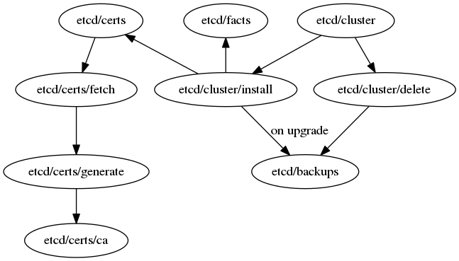

# etcd-ansible
Deploy and manage etcd cluster via Ansible


## Quick Start
1. Install mitogen plugin
```ansible-playbook -c local mitogen.yaml -vv```

2. Create an inventory with the following groups
 - [etcd]:  list of the cluster nodes
 - [etcd-clients]: list of the nodes that must receive a client certificate
See [inventory-example.ini](https://github.com/ant31/etcd-ansible/blob/master/inventory-example.ini)
```
cp inventory-example.ini inventory.ini
```

3. Install the cluster and distributes certificates to clients:
```
ansible-playbook -i inventory.ini etcd.yaml -vv  -b --become-user=root   -e etcd_action=create
```


### Roles

The playbook is composed by 4 top levels roles: cluster, facts, certs, backups

- Cluster: deploy and manage lifecycle of the etcd-nodes
- Certs: generate and synchronize etcd peer/client/server certificates
- Facts: configure some useful variables to be integrated with external roles
- Backup: create a new snapshot and upload it to an object-storage if configured
          a snapshot is created before an upgrade or delete.



### Cluster management

This role provide several actions to manage the etcd-nodes.
Possible actions are:
 - Install
 - Delete
 - Upgrade

An action is defined with "etcd_action=$ACTION" variable. There's no default, if no action is provided the playbook is doing nothing.

##### Playbook example

```yaml
# Manage etcd cluster
- hosts: etcd
  any_errors_fatal: true
  roles:
    - name: etcd/cluster

```

#### Install

The install action works only once and should not be called again on an existing cluster.
It deploys and configure an new etcd-cluster with name `etcd_cluster_name`.

```
ansible-playbook -i inventory.ini etcd.yaml -vv  -b --become-user=root  -e etcd_action=create
```

It uses binaries and systemd to manage the process. The systemd service is called by default `etcd-{{cluste_name}}-{{index}}`
```
# display status in node2 of the k8s etcd-cluster
$ systemd status etcd-k8s-2
```


##### Recover install failures

In case of a failure during the first play, it's possible to retry the same command but with the variable "etcd_force_create=true".
As an alternative, it's also possible to run an 'upgrade' with `-e etcd_action=upgrade -e etcd_sync_certs=true`

#### Upgrade

Upgrade are used to bump etcd versions, edit configuration (e.g retention_period) or rotate certificates.
It can't be used to add or remove nodes to an existing cluster, cluster size if fixed.


```
ansible-playbook -i inventory.ini etcd.yaml -vv  -b --become-user=root  -e etcd_action=upgrade -e etcd_verson=3.3.10
```


#### Delete

Delete a cluster will remove all certificates, etcd-data and configuration.
To trigger a deletion provide the variable `etcd_delete_cluster=true`
```
ansible-playbook -i inventory.ini etcd.yaml -vv  -b --become-user=root  -e etcd_delete_cluster=true
```


### Certs management

The certificate are generate from the `etcd-cert-managers` hosts then distributed to each nodes (etcd clients and peers).
To rotate the certificates (create new CA and keys) or only re-distribute the existing one, configure respectively `etcd_rotate_certs=true` and `etcd_sync_certs=true` variables.

Create a group `etcd-clients` with all hosts that should receive a client certificate.

##### Playbook example

To only manage certificate (without deploying an etcd cluster), the following playbook initializes the CA and sends certificates to the specified 'clients' hosts

```
- hosts: etcd-clients
  roles:
    - name: etcd/certs
```

Also, `/etcd/certs` can be set as a role dependency. Actually, this how the etcd-peer certificate are generated: [roles/etcd/cluster/meta/main.yml](https://github.com/ant31/etcd-ansible/blob/master/roles/etcd/cluster/install/meta/main.yml#L13)

Roles documentation can be found here: [/etcd/certs/README.md)](https://github.com/ant31/etcd-ansible/tree/master/roles/etcd/certs/README.md)

### Etcd Facts

To integrate the etcd role, and configure, for example kubernetes-apimaster with the list of etcd-client-urls, this role can be call to populate few variables.
 - etcd_access_addresses: etcd endpoints separated by a coma.
 - etcd_cert_paths: paths the certificates
 - etcd_members: dict with details about each etcd node.

##### Playbook example

The following playbook is populating `etcd_access_address` variable by calling the role etcd/facts
```
- hosts: clients
  roles:
    - name: etcd/facts
  tasks:
    - name: display members health
      command: |
        /opt/bin/etcdctl --endpoints={{ etcd_access_addresses }}
        --cert={{etcd_cert_paths.client.cert}}
        --cacert={{etcd_cert_paths.client.ca}}
        --key={{etcd_cert_paths.client.key}}
        endpoint health

```
